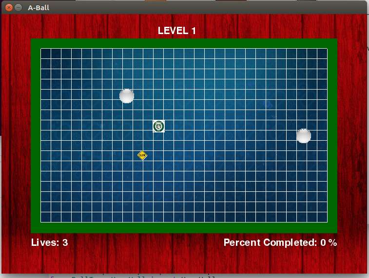
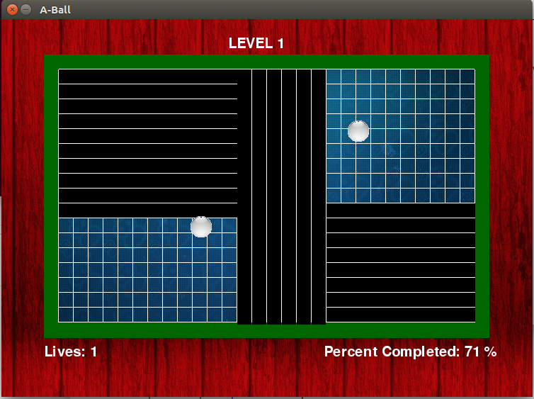
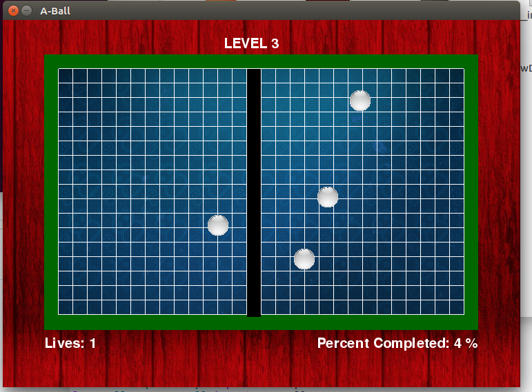

# ABall

### Project Description

ABall is a remake of JezzBall. This game made in Python using PyGame.
The objective of the game is to close off area in the game grid by 
making walls. One 75% of the area is closed off, you move on to the
next level. If the wall gets hit by one of the bouncing balls, you
lose a life. The project is fully documented for those who wish to look
at the source code.

### Controls
1. Use mouse left click to create wall
2. Use space bar to switch between draimg a horizontal and 
vertical wall.

### Game Images

